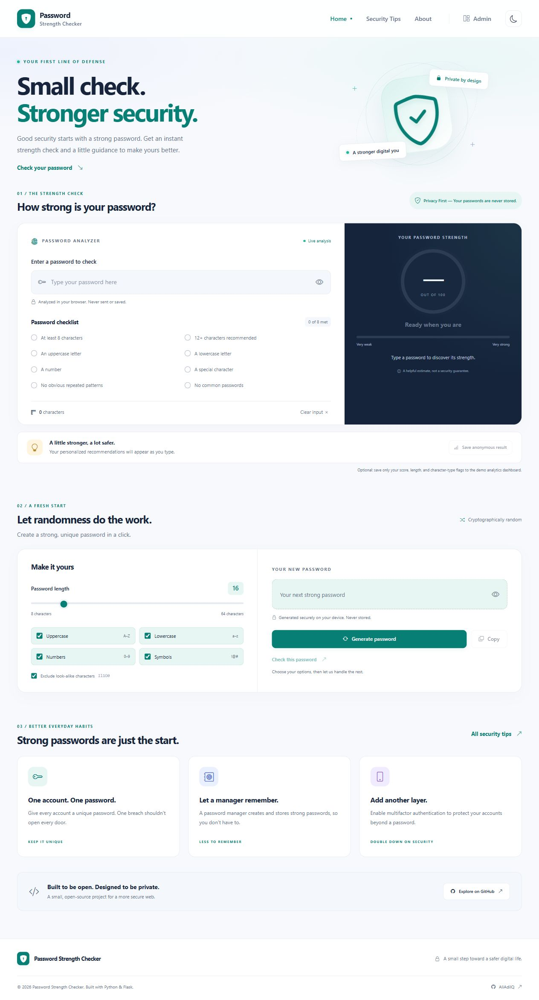
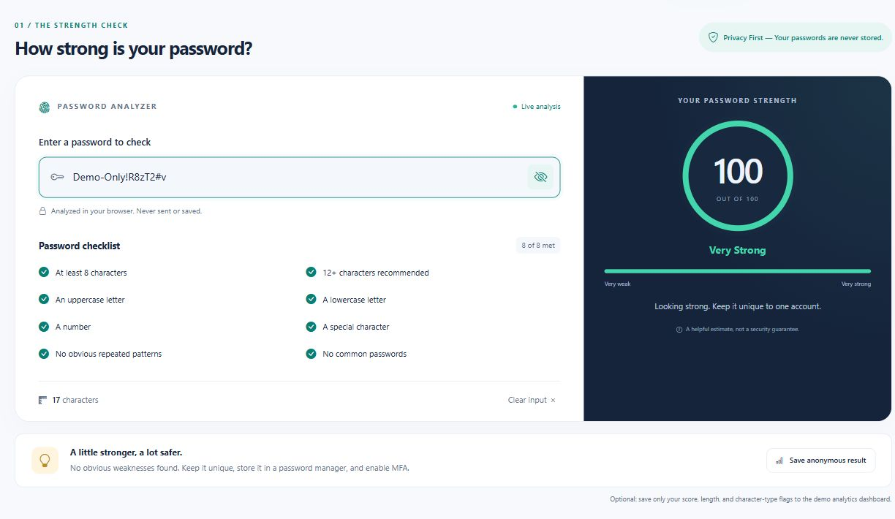
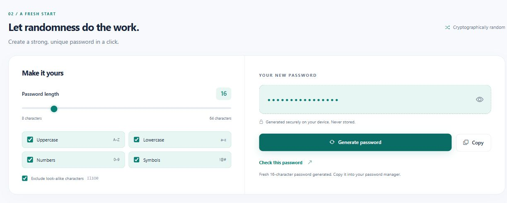
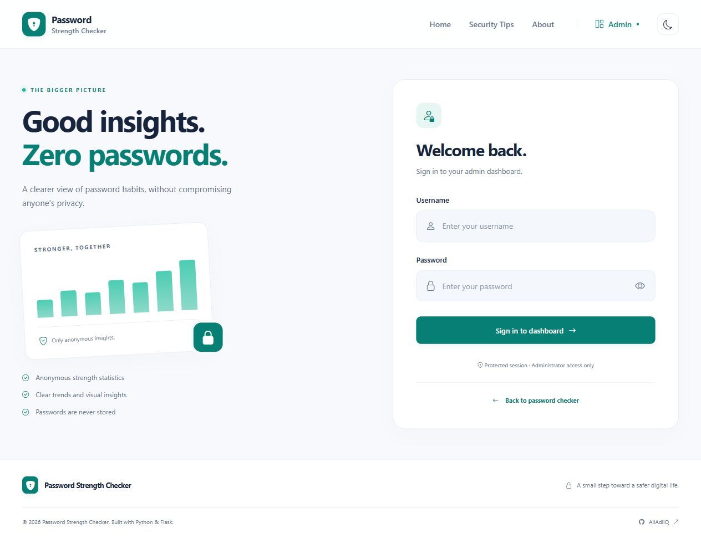
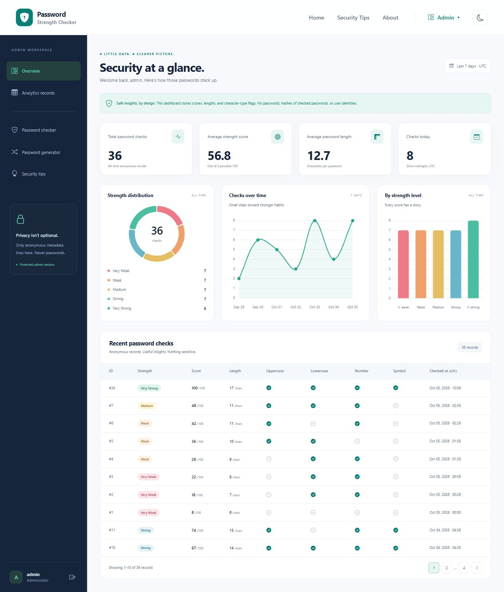

# Password Strength Checker


[](https://github.com/AliAdilQ/password_strength_checker/actions/workflows/tests.yml)

**Small check. Stronger security.** A polished, privacy-oriented Flask application that helps you understand password strength, generate secure passwords, and build better everyday security habits.

Repository: [AliAdilQ/password_strength_checker](https://github.com/AliAdilQ/password_strength_checker)

## Password Strength Checker

Get an instant score from 0 to 100, a live checklist, and practical recommendations. Create a new password with cryptographically secure randomness. Explore safe, anonymous statistics in a custom authenticated dashboard. The interface includes responsive layouts, light and dark themes, keyboard-friendly controls, and locally bundled frontend assets.

## Demo / Preview

Run locally at [http://127.0.0.1:5000](http://127.0.0.1:5000). The home page checks passwords entirely in your browser, updates eight criteria as you type, and explains how to improve the result. The generator defaults to 16 characters with all four character types and optional look-alike exclusions.

Run `python seed.py` to create the local demo admin and 35 varied analytics records across seven recent days. Sign in at `/admin/login` to explore summary statistics, doughnut/bar/line charts, and paginated metadata. The seed command is safe to repeat and doesn't duplicate demo data or overwrite an existing admin password.

These are real screenshots of the running application. The checker example is synthetic; generated passwords are hidden.

## Screenshots

### Home



### Live password check



### Secure password generator



### Admin sign in



### Analytics dashboard



## Features

- Real-time password strength checking without sending checker inputs to the server
- A 0–100 score and five strength categories
- Length, uppercase, lowercase, number, and symbol checks
- Common-password, dictionary-like, keyboard-sequence, date, and repetition penalties
- Eight live checklist indicators and tailored security recommendations
- Password visibility toggles, with inputs hidden by default
- Secure password generator using `crypto.getRandomValues()` and rejection sampling
- Adjustable length from 8 to 64, selectable character types, look-alike exclusion, copying, and checking generated passwords
- Responsive custom UI, Bootstrap Icons, and persistent light/dark mode
- Admin authentication with Werkzeug scrypt hashing and Flask-Login
- CSRF-protected login, logout, and opt-in browser analytics
- Dashboard statistics, three Chart.js charts, and paginated anonymous records
- REST API with validation and optional metadata-only analytics
- Custom 403, 404, and 500 error pages
- Modular Flask application factory, automated pytest coverage, and GitHub Actions

| Score | Strength |
| --- | --- |
| 0–24 | Very Weak |
| 25–44 | Weak |
| 45–64 | Medium |
| 65–84 | Strong |
| 85–100 | Very Strong |

## Security & Privacy

**The application never stores passwords entered into the password checker.**

Live checking and generation happen in browser memory. The app never writes these passwords to a database, cookies, localStorage, sessionStorage, logs, or an input-history cache. The only localStorage entry is your theme preference. Input values are cleared when leaving the page, and responses use `Cache-Control: no-store`.

Anonymous analytics are **opt-in**: select **Save anonymous result** to send only the score, password length, and four character-type flags. The server derives the strength category and adds a UTC timestamp. The `PasswordCheck` model has no password, password hash, IP address, or user-account field. Browser-supplied analytics are unverified educational telemetry, not an audited measurement.

The REST API temporarily analyzes a JSON password in server memory. It never echoes or hashes the password and does not save analytics by default. Set `save_analytics: true` to store only safe metadata. Request bodies are not logged. Keep request-body capture disabled in any hosting, proxy, monitoring, or debugging infrastructure you add. The local web server's normal access log can contain request paths and client addresses; it does not contain POST bodies.

Admin account passwords are separate: only their Werkzeug scrypt hashes are stored. Admin forms and browser metadata submissions require CSRF tokens; sessions use HttpOnly and SameSite=Lax cookies. Logout is a POST action. The public JSON checker API is stateless, ignores admin authentication, and is intentionally CSRF-exempt. Inputs are capped at 256 characters and request bodies at 16 KB. Frontend assets are self-hosted, and a Content Security Policy limits scripts and connections to this application.

The score is a **heuristic**, not an exact entropy estimate, crack-time prediction, or guarantee of safety. A small internal word list cannot catch every weak password; there is no breach-database check. A long randomly chosen passphrase may be secure without every character-type checkbox. Use unique passwords, a password manager, and MFA. Copying deliberately places a generated password on your system clipboard, which may retain it or participate in OS clipboard history until you replace it.

### Before public deployment

1. Replace the demo admin password with `python tools/change_admin_password.py`. It prompts securely rather than placing your new password in shell history. Don't run the demo seed on a public installation.
2. Generate a secret with `python -c "import secrets; print(secrets.token_hex(32))"` and set it in a private `.env` or deployment secret store. Never commit the result.
3. Set `APP_ENV=production` and `SESSION_COOKIE_SECURE=true`, serve exclusively over HTTPS, and keep debug mode disabled. Production startup rejects a missing/short/placeholder secret or insecure session cookies.
4. Use a production WSGI server; `python run.py` is the local development server. See [Flask deployment guidance](https://flask.palletsprojects.com/en/stable/deploying/).
5. Add deployment-level rate limiting for login and public API requests, review request logging, and restrict database/backups to the service account. Automatic brute-force throttling is not implemented in this local portfolio demo.

## Tech Stack

| Layer | Technologies |
| --- | --- |
| Backend | Python, Flask, Flask-SQLAlchemy / SQLAlchemy, Flask-Login, Flask-WTF, Werkzeug, python-dotenv |
| Frontend | HTML5, CSS3, Bootstrap 5, Bootstrap Icons, vanilla JavaScript, Chart.js |
| Database | SQLite by default; configurable via `DATABASE_URL` |
| Testing | pytest and GitHub Actions |

No Node.js runtime, frontend framework, or frontend build process is required. Python **3.10+** is required; **3.12** is recommended. Third-party frontend assets and license notices are included; see [THIRD_PARTY.md](docs/THIRD_PARTY.md).

## Project Structure

```text
password_strength_checker/
├── .github/
│   └── workflows/tests.yml
├── app/
│   ├── __init__.py               # Application factory, extensions, headers, errors
│   ├── extensions.py
│   ├── models.py                 # Admin and metadata-only PasswordCheck
│   ├── routes/
│   │   ├── __init__.py
│   │   ├── main.py
│   │   ├── api.py
│   │   └── admin.py
│   ├── services/
│   │   ├── __init__.py
│   │   ├── password_analyzer.py
│   │   └── analytics.py
│   ├── templates/
│   │   ├── base.html
│   │   ├── index.html
│   │   ├── about.html
│   │   ├── security_tips.html
│   │   ├── admin/
│   │   │   ├── login.html
│   │   │   └── dashboard.html
│   │   └── errors/error.html
│   └── static/
│       ├── css/
│       │   ├── style.css
│       │   └── admin.css
│       ├── js/
│       │   ├── main.js
│       │   ├── password-checker.js
│       │   ├── password-generator.js
│       │   └── admin.js
│       ├── data/scoring-rules.json
│       ├── images/favicon.svg
│       └── vendor/
│           ├── bootstrap.min.css
│           ├── bootstrap-icons.min.css
│           ├── chart.umd.min.js
│           ├── fonts/            # Bundled icon fonts
│           └── licenses/         # Upstream MIT notices
├── docs/
│   ├── THIRD_PARTY.md
│   └── screenshots/
│       ├── home.png
│       ├── password-check.png
│       ├── generator.png
│       ├── admin-login.png
│       └── admin-dashboard.png
├── instance/.gitkeep             # Local database is created here and ignored
├── tests/
│   ├── __init__.py
│   ├── conftest.py
│   ├── test_password_analyzer.py
│   ├── test_routes.py
│   └── test_admin.py
├── tools/
│   ├── change_admin_password.py
│   └── fetch_vendor.py
├── config.py
├── run.py
├── seed.py
├── pytest.ini
├── requirements.txt
├── .env.example
├── .gitignore
├── LICENSE
├── README.md
└── CONTRIBUTING.md
```

## Installation

Confirm `python --version` reports Python 3.10 or newer, then clone:

```bash
git clone https://github.com/AliAdilQ/password_strength_checker.git
cd password_strength_checker
```

Create and activate a virtual environment.

**Windows (Command Prompt):**

```bat
python -m venv venv
venv\Scripts\activate
```

**Windows (PowerShell):**

```powershell
python -m venv venv
.\venv\Scripts\Activate.ps1
```

If your PowerShell policy blocks activation, use Command Prompt or run `venv\Scripts\python.exe` and `venv\Scripts\pip.exe` directly; you don't need to change system policy.

**macOS / Linux:**

```bash
python3 -m venv venv
source venv/bin/activate
```

Install dependencies:

```bash
pip install -r requirements.txt
```

Create your local settings:

```bash
cp .env.example .env
```

On Windows, manually copy `.env.example` to `.env`, use `copy .env.example .env` in Command Prompt, or `Copy-Item .env.example .env` in PowerShell. Generate a random `SECRET_KEY` using the command in Security & Privacy and replace the example value. The real `.env` is ignored by Git.

Initialize demo data and run:

```bash
python seed.py
python run.py
```

Visit **[http://127.0.0.1:5000](http://127.0.0.1:5000)**. Stop the local server with Ctrl+C.

Tables are also created automatically when the app starts. The database file is `instance/password_checker.db`; it is intentionally not committed. Seeding only inserts demo analytics when the analytics table is empty. If an admin with username `admin` already exists, seeding leaves its credentials unchanged.

### Configuration

| Variable | Default | Purpose |
| --- | --- | --- |
| `SECRET_KEY` | Random per process when omitted | Signed sessions and CSRF. Set a stable random value in `.env` to preserve sessions across restarts. |
| `DATABASE_URL` | `sqlite:///password_checker.db` | SQLAlchemy database URI; relative SQLite paths use `instance/`. |
| `APP_ENV` | `development` | `production` enforces explicit secret and secure-cookie settings. |
| `SESSION_COOKIE_SECURE` | `false` | Use `true` only when serving over HTTPS. |
| `PORT` | `5000` | Local Flask server port. |

### Pages

| Route | Purpose |
| --- | --- |
| `/` | Live checker, secure generator, recommendations, and feature cards |
| `/about` | Scoring, privacy, purpose, and technologies |
| `/security-tips` | Practical password and account security guidance |
| `/admin/login` | CSRF-protected admin sign in |
| `/admin/dashboard` | Authenticated dashboard and paginated analytics |
| `/admin/logout` | CSRF-protected POST logout, available through the Sign out button |

## Demo Admin Account

**Demo Admin Credentials**

```text
Username: admin
Email: admin@example.com
Password: Admin@12345
```

> These credentials are provided for local demonstration purposes only. Change them before deploying the application publicly.

## API Usage

### `POST /api/check-password`

Send `Content-Type: application/json`. Passwords must be non-empty strings of 1–256 Unicode characters. The example below is explicitly synthetic.

```json
{
  "password": "Demo-Only!R8zT2#v"
}
```

Example response:

```json
{
  "score": 100,
  "strength": "Very Strong",
  "password_length": 17,
  "criteria": {
    "uppercase": true,
    "lowercase": true,
    "number": true,
    "symbol": true
  },
  "checklist": {
    "minimum_length": true,
    "recommended_length": true,
    "uppercase": true,
    "lowercase": true,
    "number": true,
    "symbol": true,
    "no_patterns": true,
    "not_common": true
  },
  "criteria_passed": 8,
  "recommendations": []
}
```

To opt into storing only this result's safe metadata, include `"save_analytics": true`. The password is never saved or returned. The default request performs no database writes. Don't send real passwords in URLs or shell commands; use an appropriate HTTPS API client when deployed.

### `POST /api/analytics`

The browser uses this endpoint for optional metadata-only saving. Submit exactly these fields, with the `X-CSRFToken` from the page's `csrf-token` meta tag and the matching session cookie:

```json
{
  "score": 100,
  "password_length": 17,
  "criteria": {
    "uppercase": true,
    "lowercase": true,
    "number": true,
    "symbol": true
  }
}
```

Returns `201` on success. Extra fields, including `password` or `password_hash`, are rejected. The server assigns the category and timestamp.

| Status | Meaning |
| --- | --- |
| `200` | Analysis completed |
| `201` | Anonymous metadata saved |
| `400` | Invalid fields, malformed JSON, or missing/expired CSRF token on browser metadata submissions |
| `413` | Request exceeds 16 KB |
| `415` | Checker request is not JSON |

Authenticated `GET /admin/stats` supplies chart aggregates. Analytics timestamps and daily boundaries are in UTC.

## Running Tests

Activate your virtual environment, then run:

```bash
pytest
```

Tests use isolated temporary SQLite databases and synthetic input. They cover strength categories and thresholds, common-password and pattern penalties, Unicode, public routes, bundled assets, API validation, opt-in metadata, password non-retention, CSRF, secure cookies, valid/invalid login, protected dashboards, logout, idempotent seeding, and pagination. GitHub Actions runs the same suite on Python 3.12.

## Future Improvements

- Breach checking with the Have I Been Pwned k-anonymity API
- Optional user accounts and richer aggregate history without storing passwords
- Stronger dictionaries and estimator validation
- Docker support and PostgreSQL deployment
- Login and API rate limiting
- Multifactor admin authentication and passkeys
- Multilingual interface

## Contributing

Fork the repository, create a feature branch, run tests and relevant browser checks, then submit a focused pull request. See [CONTRIBUTING.md](CONTRIBUTING.md) for the workflow and privacy requirements.

## License

This project is licensed under the [MIT License](LICENSE). Bundled third-party assets retain their upstream MIT license notices.

## Author

**AliAdilQ**

- GitHub: [github.com/AliAdilQ](https://github.com/AliAdilQ)
- Repository: [github.com/AliAdilQ/password_strength_checker](https://github.com/AliAdilQ/password_strength_checker)
